---
## Front matter
title: "Лабораторная работа №3"
subtitle: "дисциплина: Архитектура компьютера"
author: "Кирилюк Светлана Алексеевна"

## Generic otions
lang: ru-RU
toc-title: "Содержание"

## Bibliography
bibliography: bib/cite.bib
csl: pandoc/csl/gost-r-7-0-5-2008-numeric.csl

## Pdf output format
toc: true # Table of contents
toc-depth: 2
lof: true # List of figures
lot: false # List of tables
fontsize: 12pt
linestretch: 1.5
papersize: a4
documentclass: scrreprt
## I18n polyglossia
polyglossia-lang:
  name: russian
  options:
	- spelling=modern
	- babelshorthands=true
polyglossia-otherlangs:
  name: english
## I18n babel
babel-lang: russian
babel-otherlangs: english
## Fonts
mainfont: PT Serif
romanfont: PT Serif
sansfont: PT Sans
monofont: PT Mono
mainfontoptions: Ligatures=TeX
romanfontoptions: Ligatures=TeX
sansfontoptions: Ligatures=TeX,Scale=MatchLowercase
monofontoptions: Scale=MatchLowercase,Scale=0.9
## Biblatex
biblatex: true
biblio-style: "gost-numeric"
biblatexoptions:
  - parentracker=true
  - backend=biber
  - hyperref=auto
  - language=auto
  - autolang=other*
  - citestyle=gost-numeric
## Pandoc-crossref LaTeX customization
figureTitle: "Рис."
tableTitle: "Таблица"
listingTitle: "Листинг"
lofTitle: "Список иллюстраций"
lotTitle: "Список таблиц"
lolTitle: "Листинги"
## Misc options
indent: true
header-includes:
  - \usepackage{indentfirst}
  - \usepackage{float} # keep figures where there are in the text
  - \floatplacement{figure}{H} # keep figures where there are in the text
---

# Цель работы

Целью работы является изучить идеологию и применение средств контроля версий. Приобрести практические навыки по работе с системой git.

# Выполнение лабораторной работы

1. Настройка github.
1) В первую очередь я создала учетную запись на сайте https://github.com/ и заполнила основные данные: Email, имя пользователя и пароль (рис. [-@fig:fig1]).

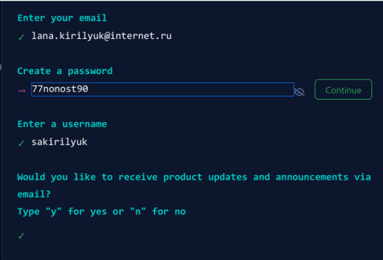{ #fig:fig1 width=90% }

2. Базовая настройка git.
1)Открыв терминал и введя команды, имя и email, я начала выполнять предварительную конфигурацию git (рис. [-@fig:fig2]) и (рис. [-@fig:fig3])

{ #fig:fig2 width=90% }

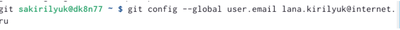{ #fig:fig3 width=90% }

2)Настроила utf-8 в выводе сообщений git (рис. [-@fig:fig4]).

{ #fig:fig4 width=90% }

3)Задала имя начальной ветки – master (рис. [-@fig:fig5]).

{ #fig:fig5 width=90% }

4) Задала парметр autocrlf и safecrlf (рис. [-@fig:fig6]) и (рис. [-@fig:fig7]).

{ #fig:fig6 width=90% }

{ #fig:fig7 width=90% }

3. Создание SSH ключа.
Я сгенерировала пару ключей (приватный и открытый) (рис. [-@fig:fig8]) загрузила открытый ключ на сайт (рис. [-@fig:fig9]) редварительно скопировав его на локальной консоли в буфере обмена (рис. [-@fig:fig10]).

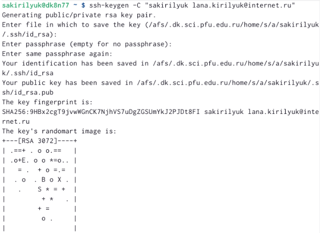{ #fig:fig8 width=90% }

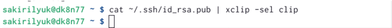{ #fig:fig9 width=90% }

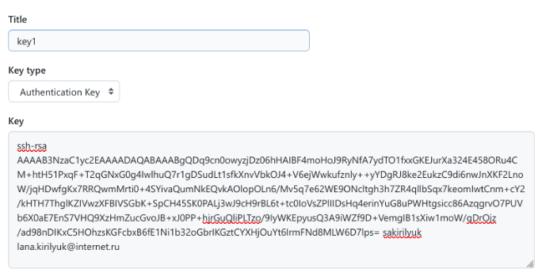{ #fig:fig10 width=90% }

4. Создание рабочего пространства и репозитория курса.
Открыв терминал, я создала каталог для предмета “Архитектура Компьютера” (рис. [-@fig:fig11]).

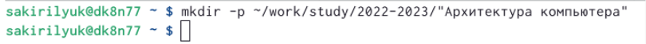{ #fig:fig11 width=90% }

5.Настройка каталога курса.
1)Я перешла на страницу репозитория с шаблоном курса https://github.com/yamadharma/course-directory-student-template и выбрала Use this template. Затем в открывшемся окне задала имя репозитория и создала его (рис. [-@fig:fig12]). 

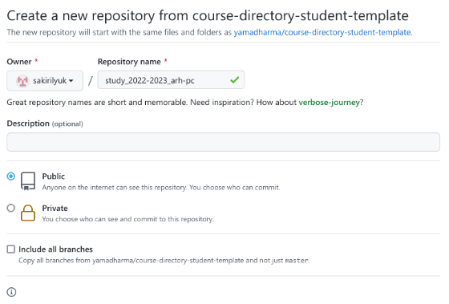{ #fig:fig12 width=90% }

2) Открыв терминал, я перешла в каталог курса (рис. [-@fig:fig13]) и клонировала данный репозиторий, скопировав ссылку на странице репозитория (рис. [-@fig:fig14]).

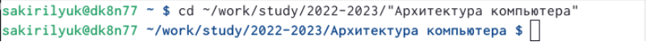{ #fig:fig13 width=90% }

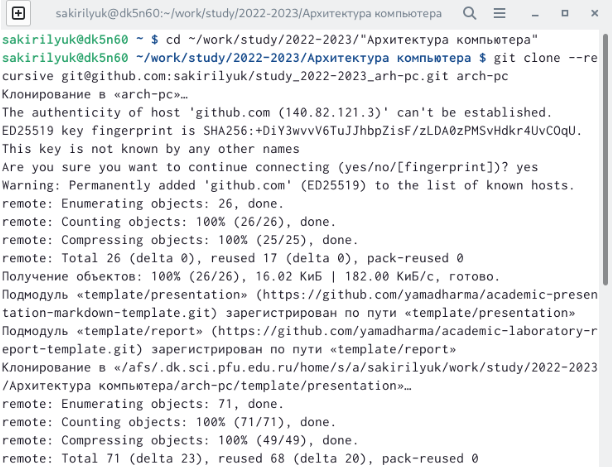{ #fig:fig14 width=90% }

3) Перейдя в каталог курса, я начала его настройку (рис. [-@fig:fig15]).

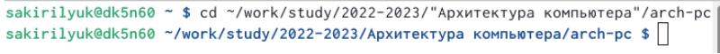{ #fig:fig15 width=90% }

4)Сначала я удалила все лишние файлы (рис. [-@fig:fig16]).

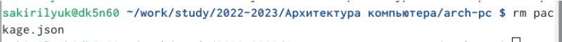{ #fig:fig16 width=90% }

5) Затем создала все необходимые каталоги (рис. [-@fig:fig17]).

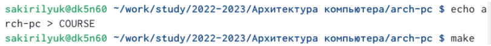{ #fig:fig17 width=90% }

6) Отправила все файлы на сервер (рис. [-@fig:fig18]) и (рис. [-@fig:fig19]).

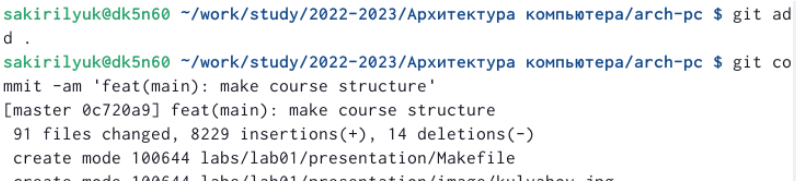{ #fig:fig18 width=90% }

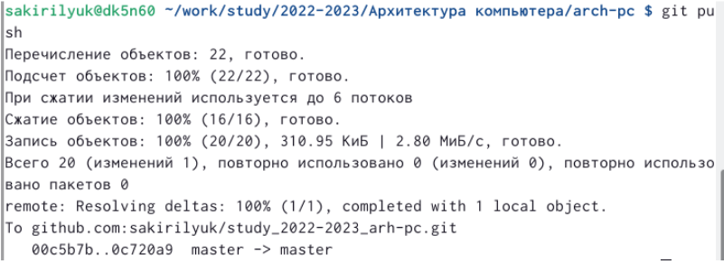{ #fig:fig19 width=90% }

7) Затем я проверила правильность создания иерархии рабочего пространства в локальном репозитории (рис. [-@fig:fig20]).

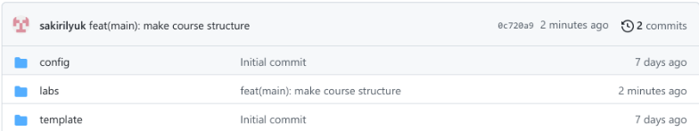{ #fig:fig20 width=90% }

# Выполнение заданий для самостоятельной работы

1) Я создала отчет по выполнению этой лабораторной работы и скопировала его в репозиторий.

2)Аналогичным образом я скопировала в репозиторий отчеты по предыдущим лабораторным работам. Пример операции копирования, основанный на первой лабораторной работе (рис. [-@fig:fig21]), (рис. [-@fig:fig22]) и (рис. [-@fig:fig23]).

{ #fig:fig21 width=90% }

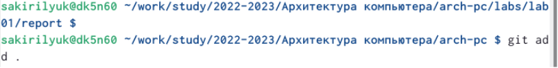{ #fig:fig22 width=90% }

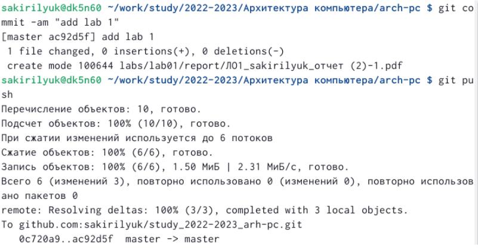{ #fig:fig23 width=90% }

# Выводы

В ходе работы я изучила идеологию и применение средств контроля версий. Приобрела практические навыки по работе с системой git.

:::
