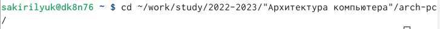
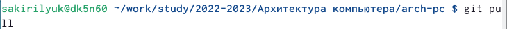
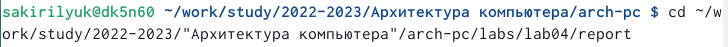
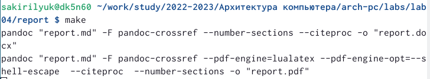
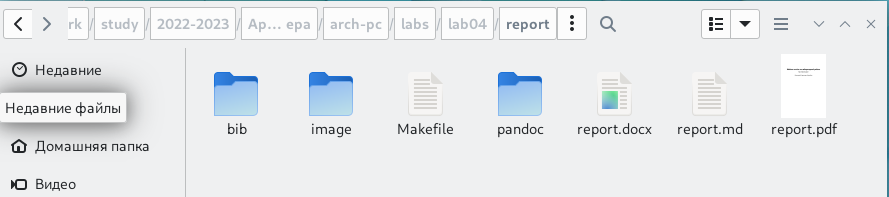
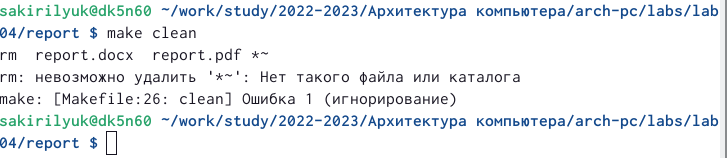
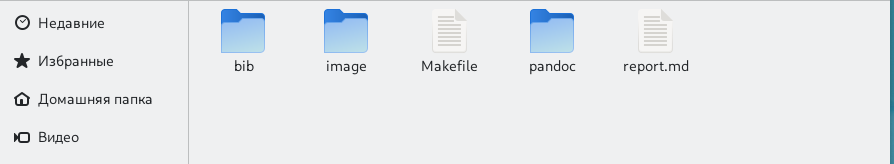
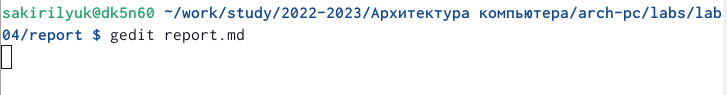

---
## Front matter
title: "Лабораторная работа №4"
subtitle: "дисциплина: Архитектура компьютера"
author: "Кирилюк Светлана Алексеевна"

## Generic otions
lang: ru-RU
toc-title: "Содержание"

## Bibliography
bibliography: bib/cite.bib
csl: pandoc/csl/gost-r-7-0-5-2008-numeric.csl

## Pdf output format
toc: true # Table of contents
toc-depth: 2
lof: true # List of figures
lot: false # List of tables
fontsize: 12pt
linestretch: 1.5
papersize: a4
documentclass: scrreprt
## I18n polyglossia
polyglossia-lang:
  name: russian
  options:
	- spelling=modern
	- babelshorthands=true
polyglossia-otherlangs:
  name: english
## I18n babel
babel-lang: russian
babel-otherlangs: english
## Fonts
mainfont: PT Serif
romanfont: PT Serif
sansfont: PT Sans
monofont: PT Mono
mainfontoptions: Ligatures=TeX
romanfontoptions: Ligatures=TeX
sansfontoptions: Ligatures=TeX,Scale=MatchLowercase
monofontoptions: Scale=MatchLowercase,Scale=0.9
## Biblatex
biblatex: true
biblio-style: "gost-numeric"
biblatexoptions:
  - parentracker=true
  - backend=biber
  - hyperref=auto
  - language=auto
  - autolang=other*
  - citestyle=gost-numeric
## Pandoc-crossref LaTeX customization
figureTitle: "Рис."
tableTitle: "Таблица"
listingTitle: "Листинг"
lofTitle: "Список иллюстраций"
lotTitle: "Список таблиц"
lolTitle: "Листинги"
## Misc options
indent: true
header-includes:
  - \usepackage{indentfirst}
  - \usepackage{float} # keep figures where there are in the text
  - \floatplacement{figure}{H} # keep figures where there are in the text
---
# Цель работы

Целью работы является освоение процедуры оформления отчетов с помощью
легковесного языка разметки Markdown.

# Выполнение лабораторной работы

1. Сначала я открыла терминал, для того чтобы перейти в каталог курса,сформированный при выполнении лабораторной работы №3 (рис. [-@fig:fig1]).

{ #fig:fig1 width=90% }

2. Затем я обновила локальный репозиторий, скачав изменения из удаленного репози-
тория с помощью команды git pull (рис. [-@fig:fig2]).

{ #fig:fig2 width=90% }

3. Далее я перешла в каталог с шаблоном отчета по лабораторной работе №4 (рис. [-@fig:fig3]) и провела компиляцию шаблона с использованием Makefile при помощи команды make (рис. [-@fig:fig4]). Компиляция прошла успешно: файлы report.pdf и report.docx сгенерировались. Открыв каталог "work" я проверила корректность полученных файлов (рис. [-@fig:fig5]).

{ #fig:fig3 width=90% }

{ #fig:fig4 width=90% }

{ #fig:fig5 width=90% }

4. Введя команду make clean, я удалила все полученный файлы с использованием Makefile (рис. [-@fig:fig6]), затем проверила, что после этой команды файлы report.pdf и report.docx были удалены (рис. [-@fig:fig7]).

{ #fig:fig6 width=90% }

{ #fig:fig7 width=90% }

5. Далее я открыла файл report.md c текстового редактора (gedit) (рис. [-@fig:fig8]). Заполнила отчет и скомпилировала отчет с использованием Makefile. Затем проверила корректность полученных файлов. 

{ #fig:fig8 width=90% }

6. В конце работы я загрузила файлы на github.

# Выполнение заданий для самостоятельной работы 

Аналогичным образом я сделала отчёт по лабораторной работе №3 в формате Markdown и загрузила на github.

# Выводы
В ходе работы я освоила процедуры оформления отчетов с помощью легковесного языка разметки Markdown.

