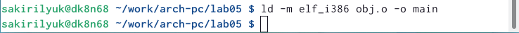

---
## Front matter
title: "Лабораторная работа №5"
subtitle: "Архитектура компьютеров"
author: "Кирилюк Светлана Алексеевна"

## Generic otions
lang: ru-RU
toc-title: "Содержание"

## Bibliography
bibliography: bib/cite.bib
csl: pandoc/csl/gost-r-7-0-5-2008-numeric.csl

## Pdf output format
toc: true # Table of contents
toc-depth: 2
lof: true # List of figures
lot: true # List of tables
fontsize: 12pt
linestretch: 1.5
papersize: a4
documentclass: scrreprt
## I18n polyglossia
polyglossia-lang:
  name: russian
  options:
	- spelling=modern
	- babelshorthands=true
polyglossia-otherlangs:
  name: english
## I18n babel
babel-lang: russian
babel-otherlangs: english
## Fonts
mainfont: PT Serif
romanfont: PT Serif
sansfont: PT Sans
monofont: PT Mono
mainfontoptions: Ligatures=TeX
romanfontoptions: Ligatures=TeX
sansfontoptions: Ligatures=TeX,Scale=MatchLowercase
monofontoptions: Scale=MatchLowercase,Scale=0.9
## Biblatex
biblatex: true
biblio-style: "gost-numeric"
biblatexoptions:
  - parentracker=true
  - backend=biber
  - hyperref=auto
  - language=auto
  - autolang=other*
  - citestyle=gost-numeric
## Pandoc-crossref LaTeX customization
figureTitle: "Рис."
tableTitle: "Таблица"
listingTitle: "Листинг"
lofTitle: "Список иллюстраций"
lotTitle: "Список таблиц"
lolTitle: "Листинги"
## Misc options
indent: true
header-includes:
  - \usepackage{indentfirst}
  - \usepackage{float} # keep figures where there are in the text
  - \floatplacement{figure}{H} # keep figures where there are in the text
---

# Цель работы

Освоение процедуры компиляции и сборки программ, написанных на ассемблере NASM.

# Выполнение лабораторной работы

Сначала я создала каталог для работы с программами на языке ассемблера NASM (рис. [-@fig:fig1]), перешла в него (рис. [-@fig:fig2]).

{ #fig:fig1 width=90% }

{ #fig:fig2 width=90% }

Создала текстовый файл (рис. [-@fig:fig3]) и открыла его с помощью текстового редактора (рис. [-@fig:fig4]) и ввела в него текст (рис. [-@fig:fig5]).

{ #fig:fig3 width=90% }

{ #fig:fig4 width=90% }

{ #fig:fig5 width=90% }

Затем я скомпилирова написанный текст с помощью команды (рис. [-@fig:fig6]), скомпилировала файл (рис. [-@fig:fig7]), отправила файл на обработку (рис. [-@fig:fig8]) и выполнила следующую команду (рис. [-@fig:fig9]).

{ #fig:fig6 width=90% }

{ #fig:fig7 width=90% }

{ #fig:fig8 width=90% }

{ #fig:fig9 width=90% }

И, наконец, я запустила файл с помощью команды (рис. [-@fig:fig10]).

{ #fig:fig10 width=90% }

#Выполнение задания для самостоятельной работы

В каталоге ~/work/arch-pc/lab05 с помощью команды cp я создала копию файла hello.asm (рис. [-@fig:fig11]) и переименовала его (рис. [-@fig:fig12]).

{ #fig:fig11 width=90% }

{ #fig:fig12 width=90% }

Затем с помощью текстового редактора внесла изменения в текст программы в файле lab5.asm так, чтобы вместо Hello world! на экран выводилась строка с моими фамилией и именем (рис. [-@fig:fig13]), (рис. [-@fig:fig14]), (рис. [-@fig:fig15]), (рис. [-@fig:fig16]), (рис. [-@fig:fig17]), (рис. [-@fig:fig18]), (рис. [-@fig:fig19]).

{ #fig:fig13 width=90% }

{ #fig:fig14 width=90% }

{ #fig:fig15 width=90% }

{ #fig:fig16 width=90% }

{ #fig:fig17 width=90% }

{ #fig:fig18 width=90% }

{ #fig:fig19 width=90% }

Скопировала файлы hello.asm и lab5.asm в свой локальный репозиторий в каталог ~/work/study/2022-2023/"Архитектура компьютера"/arch-pc/labs/lab05/ (рис. [-@fig:fig20]), (рис. [-@fig:fig21]).

{ #fig:fig20 width=90% }

{ #fig:fig21 width=90% }

Загрузила всё на Github (рис. [-@fig:fig22]).

{ #fig:fig22 width=90% }

# Выводы

В ходе лабораторной ра боты я освоила процедуры компиляции и сборки программ, написанных на ассемблере NASM.

