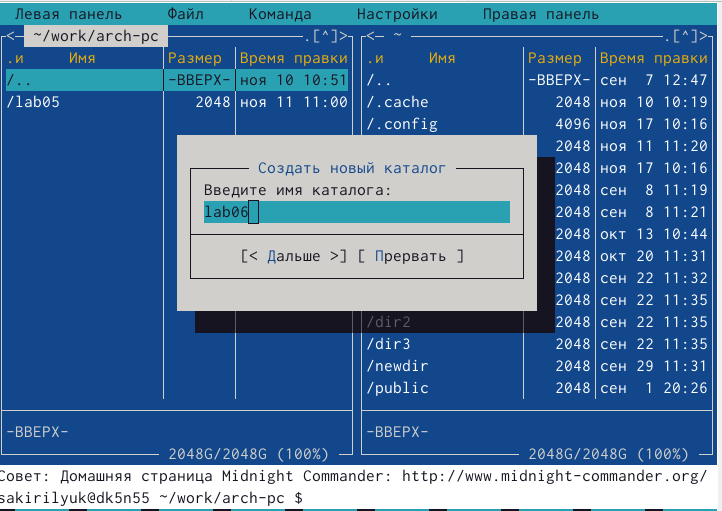
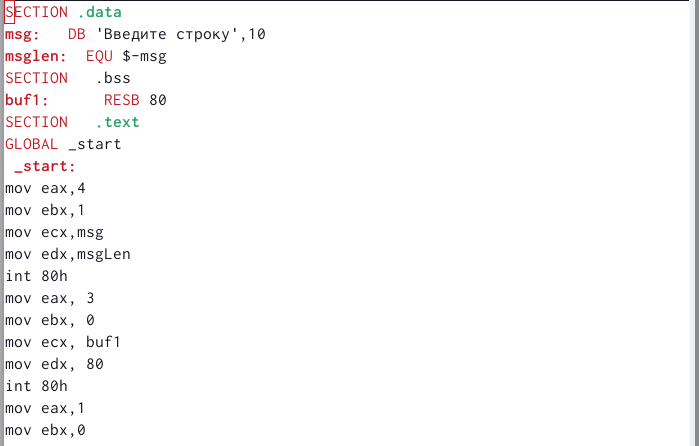
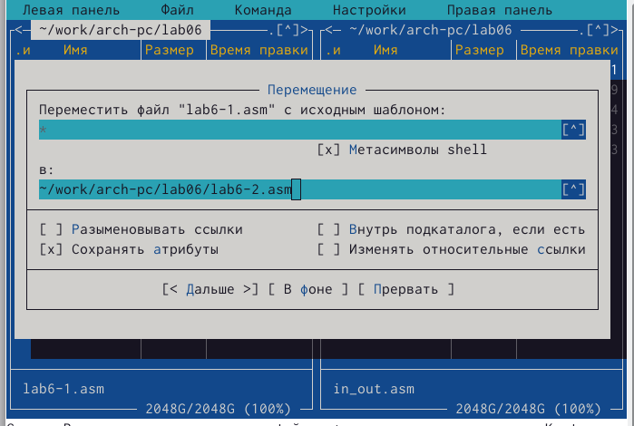

---
## Front matter
title: "Лабораторная работа №6"
subtitle: "Архитектура компьютера"
author: "Кирилюк Светлана Алексеевна"

## Generic otions
lang: ru-RU
toc-title: "Содержание"

## Bibliography
bibliography: bib/cite.bib
csl: pandoc/csl/gost-r-7-0-5-2008-numeric.csl

## Pdf output format
toc: true # Table of contents
toc-depth: 2
lof: true # List of figures
lot: true # List of tables
fontsize: 12pt
linestretch: 1.5
papersize: a4
documentclass: scrreprt
## I18n polyglossia
polyglossia-lang:
  name: russian
  options:
	- spelling=modern
	- babelshorthands=true
polyglossia-otherlangs:
  name: english
## I18n babel
babel-lang: russian
babel-otherlangs: english
## Fonts
mainfont: PT Serif
romanfont: PT Serif
sansfont: PT Sans
monofont: PT Mono
mainfontoptions: Ligatures=TeX
romanfontoptions: Ligatures=TeX
sansfontoptions: Ligatures=TeX,Scale=MatchLowercase
monofontoptions: Scale=MatchLowercase,Scale=0.9
## Biblatex
biblatex: true
biblio-style: "gost-numeric"
biblatexoptions:
  - parentracker=true
  - backend=biber
  - hyperref=auto
  - language=auto
  - autolang=other*
  - citestyle=gost-numeric
## Pandoc-crossref LaTeX customization
figureTitle: "Рис."
tableTitle: "Таблица"
listingTitle: "Листинг"
lofTitle: "Список иллюстраций"
lotTitle: "Список таблиц"
lolTitle: "Листинги"
## Misc options
indent: true
header-includes:
  - \usepackage{indentfirst}
  - \usepackage{float} # keep figures where there are in the text
  - \floatplacement{figure}{H} # keep figures where there are in the text
---

# Цель работы

Приобретение практических навыков работы в Midnight Commander. Освоение инструкций языка ассемблера mov и int.

# Выполнение лабораторной работы

Для начала при помощи команды в терминале я открыла Midnight Commander (рис. [-@fig:fig1])

{ #fig:fig1 width=90% }

Затем я перешла в каталог ~/work/arch-pc (рис. [-@fig:fig2]), создала в нем папку lab06 (рис. [-@fig:fig3]) и перешла в созданный каталог, где, пользуясь командой touch, создала файл lab6-1.asm (рис. [-@fig:fig4]).

{ #fig:fig2 width=90% }

{ #fig:fig3 width=90% }

{ #fig:fig4 width=90% }

С помощью функциональной клавиши F4 я открыла файл lab6-1.asm для редактирования во встроенном редакторе и ввела текст программы (рис. [-@fig:fig5]), затем я оттранслировала текст программы lab6-1.asm в объектный файл. Выполнила компоновку объектного файла и запустила получившийся исполняемый файл. Программа вывела строку 'Введите строку'. На запрос я ввела свои ФИО (рис. [-@fig:fig6]).

{ #fig:fig5 width=90% } 

{ #fig:fig6 width=90% }

Затем я скачала in_out.asm и с помощью клавиши F5 переместила его в каталог с программой: я запустила Midnight Commander и открыла каталог с файлом lab6-1.asm в левой панели, а в правой - каталог со скаченным файлом in_out.asm (рис. [-@fig:fig7]). С помощью функциональной клавиши F6 создала копию файла lab6-1.asm с именем lab6-2.asm (рис. [-@fig:fig8]). Использовав подпрограммы из внешнего файла in_out.asm, я исправила текст программы в файле lab6-2.asm (рис. [-@fig:fig9]), затем проделала аналогичные операции, как с lab6-1.asm, чтобы создать исполняемый файл. В файле lab6-2.asm я заменила подпрограмму sprintLF на sprint и, проверив его работу я поняла, что он отличается от lab6-1.asm форматом вывода текста (рис. [-@fig:fig10]).

{ #fig:fig7 width=90% }

{ #fig:fig8 width=90% }

{ #fig:fig9 width=90% }

{ #fig:fig10 width=90% }

#Выполнение заданий для самостоятельной работы

Для начала я создала копию файла lab6-1.asm (рис. [-@fig:fig11]) и внесла соответствующие изменения в программу (рис. [-@fig:fig12]).

{ #fig:fig11 width=90% }

{ #fig:fig12 width=90% }

Затем я оттранслировала текст программы lab6-3.asm в объектный файл, выполнила компоновку объектного файла и запустила получившийся исполняемый файл (рис. [-@fig:fig13]). 

{ #fig:fig13 width=90% }

Аналогичным образом я создала копию файла lab6-2.asm (рис. [-@fig:fig14]) и внесла соответствующие изменения в программу (рис. [-@fig:fig15]). Затем я оттранслировала текст программы lab6-4.asm в объектный файл, выполнила компоновку объектного файла и запустила получившийся исполняемый файл (рис. [-@fig:fig16]). 

{ #fig:fig14 width=90% }

{ #fig:fig15 width=90% }

{ #fig:fig16 width=90% }

# Выводы

В ходе лабораторной работы я приобрела практические навыки работы в Midnight Commander. Освоенила инструкций языка ассемблера mov и int.

