---
## Front matter
title: "Лабораторная работа №7"
subtitle: "Архитектура компьютера"
author: "Кирилюк Светлана Алексеевна"

## Generic otions
lang: ru-RU
toc-title: "Содержание"

## Bibliography
bibliography: bib/cite.bib
csl: pandoc/csl/gost-r-7-0-5-2008-numeric.csl

## Pdf output format
toc: true # Table of contents
toc-depth: 2
lof: true # List of figures
lot: true # List of tables
fontsize: 12pt
linestretch: 1.5
papersize: a4
documentclass: scrreprt
## I18n polyglossia
polyglossia-lang:
  name: russian
  options:
	- spelling=modern
	- babelshorthands=true
polyglossia-otherlangs:
  name: english
## I18n babel
babel-lang: russian
babel-otherlangs: english
## Fonts
mainfont: PT Serif
romanfont: PT Serif
sansfont: PT Sans
monofont: PT Mono
mainfontoptions: Ligatures=TeX
romanfontoptions: Ligatures=TeX
sansfontoptions: Ligatures=TeX,Scale=MatchLowercase
monofontoptions: Scale=MatchLowercase,Scale=0.9
## Biblatex
biblatex: true
biblio-style: "gost-numeric"
biblatexoptions:
  - parentracker=true
  - backend=biber
  - hyperref=auto
  - language=auto
  - autolang=other*
  - citestyle=gost-numeric
## Pandoc-crossref LaTeX customization
figureTitle: "Рис."
tableTitle: "Таблица"
listingTitle: "Листинг"
lofTitle: "Список иллюстраций"
lotTitle: "Список таблиц"
lolTitle: "Листинги"
## Misc options
indent: true
header-includes:
  - \usepackage{indentfirst}
  - \usepackage{float} # keep figures where there are in the text
  - \floatplacement{figure}{H} # keep figures where there are in the text
---

# Цель работы

Освоение арифметических инструкций языка ассемблера NASM.

# Выполнение лабораторной работы

Сначала я создала каталог для программ лабораторной работы №7, перешла в него и создала файл lab7-1.asm (рис. [-@fig:fig1]).

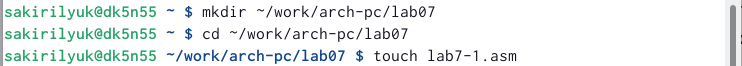{ #fig:fig1 width=90% }

Затем я ввела текст программы из листинга 7.1 (рис. [-@fig:fig2]) и запустила файл (рис. [-@fig:fig3]).

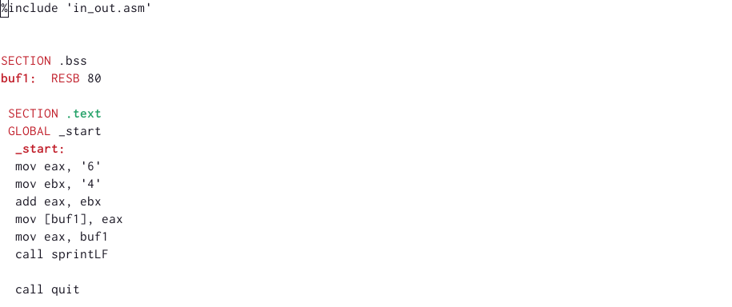{ #fig:fig2 width=90% } 

{ #fig:fig3 width=90% } 

Далее я поменяла текст программы, записав место символов в регистры числа (рис. [-@fig:fig4]), создала исполняемый файл и запустила его (рис. [-@fig:fig5]). 10 - символ перевода строки, поэтому при выводе на экран он не отображается.

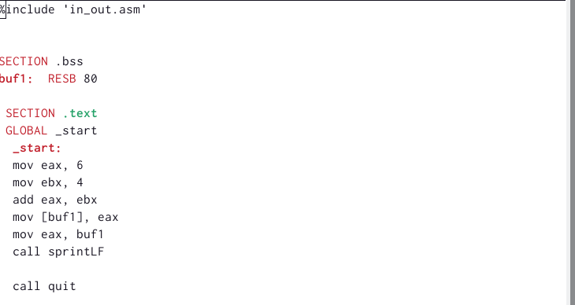{ #fig:fig4 width=90% } 

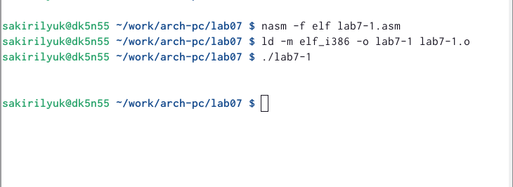{ #fig:fig5 width=90% } 

Создала новый файл lab7-2.asm (рис. [-@fig:fig6]), ввела в него текст программы из второго листинга (рис. [-@fig:fig7]) и запустила программу (рис. [-@fig:fig8]), создав исполняемый файл.

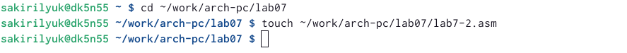{ #fig:fig6 width=90% } 

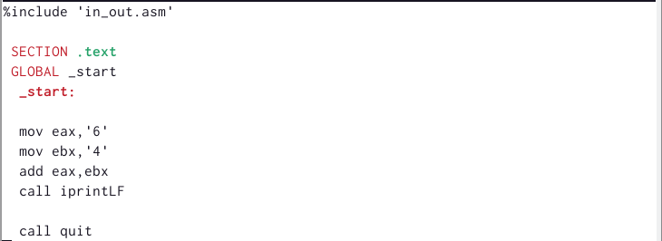{ #fig:fig7 width=90% } 

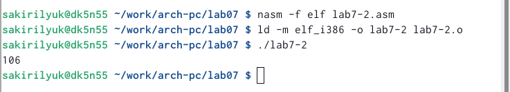{ #fig:fig8 width=90% } 

Аналогично я изменила текст второго файла (рис. [-@fig:fig9]) и запустила его (рис. [-@fig:fig10]), создав исполняемый файл.

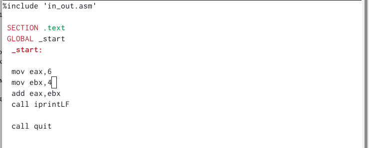{ #fig:fig9 width=90% }

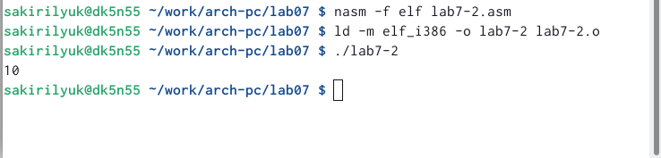{ #fig:fig10 width=90% } 

В том же файле, в тексте программы, я заменила функцию iprintLF на iprint, создала исполняемый файл и зпустила его (рис. [-@fig:fig11]).

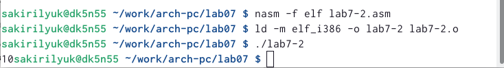{ #fig:fig11 width=90% } 

Далее я создала третий файл (рис. [-@fig:fig12]) и ввела туда текст программы из листинга 7.3 (рис. [-@fig:fig13]).

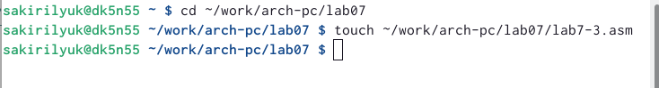{ #fig:fig12 width=90% } 

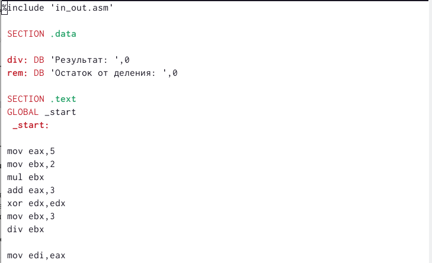{ #fig:fig13 width=90% } 

Я вновь создала исполняемый файл и запустила его (рис. [-@fig:fig14]), затем изменила текст программы для вычисления выражения f(x)=(4*6+2)/5 (рис. [-@fig:fig15]) запустила исполняемый файл (рис. [@fig:fig16]).

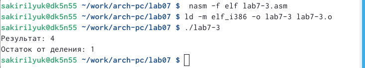{ #fig:fig14 width=90% } 

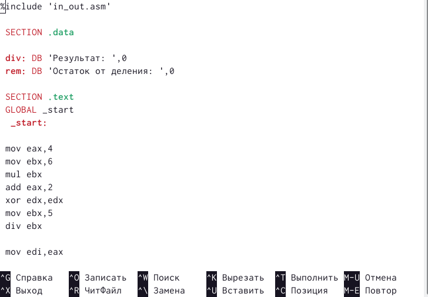{ #fig:fig15 width=90% } 

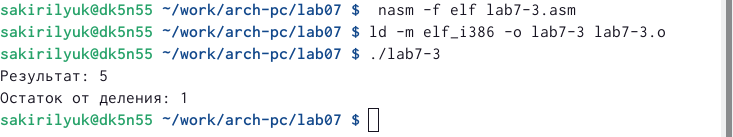{ #fig:fig16 width=90% } 

Я создала новый файл variant.asm (рис. [-@fig:fig17]), ввела в него текст программы из листинга 7.4 (рис. [-@fig:fig18]), создала исполняемый файл и запустила его (рис. [-@fig:fig19]).

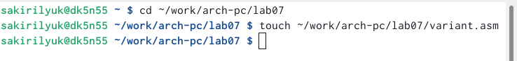{ #fig:fig17 width=90% } 

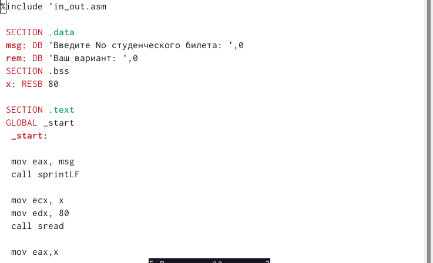{ #fig:fig18 width=90% } 

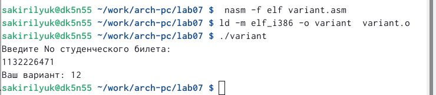{ #fig:fig19 width=90% } 

#Ответы на вопросы

1)За вывод на экран сообщений отвечают такие строки листинга, как: mov, eax, rem, call sprint.

2)Инструкции nasm mov ecx, x mov edx, 80 call sread используются для ввода переменной X с клавиатуры и сохранения введённых данных.

3)Инструкция “call atoi” используется для преобразования кода переменной ASCII в число.

4)За вычисления варианта отвечают xor edx, edx; mov ebx, 20 div ebx inc edx.

5)Остаток от деления при выполнении инструкции “div ebx” записывается в регистр edx.

6)Инструкция “inc edx” используется для увелечения значения edx на 1.

7)За вывод на экран результата вычислений отвечают mov eax, edx call iprintLF.

#Выполнение задания для самостоятельной работы

Мне достался пример из варианта №12. Для начала я создала новый файл 12.asm, затем ввела текст программы (рис. [-@fig:fig20]), (рис. [-@fig:fig21]), (рис. [-@fig:fig22]), создала исполняемый файл и запустила его (рис. [-@fig:fig23]).

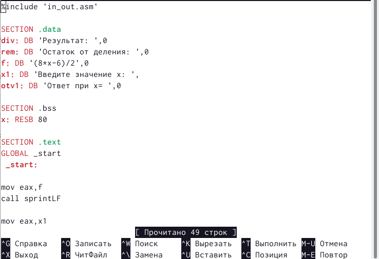{ #fig:fig20 width=90% } 

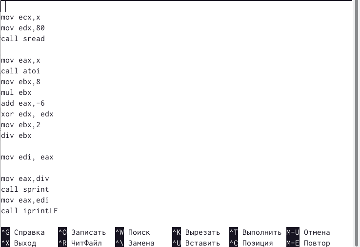{ #fig:fig21 width=90% } 

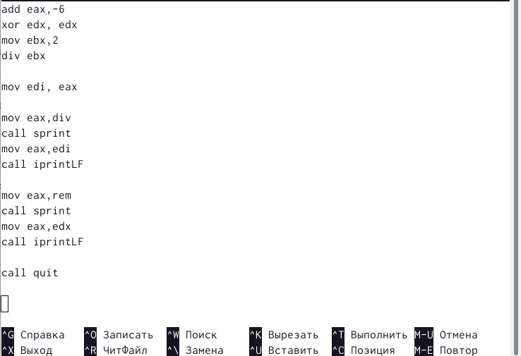{ #fig:fig22 width=90% } 

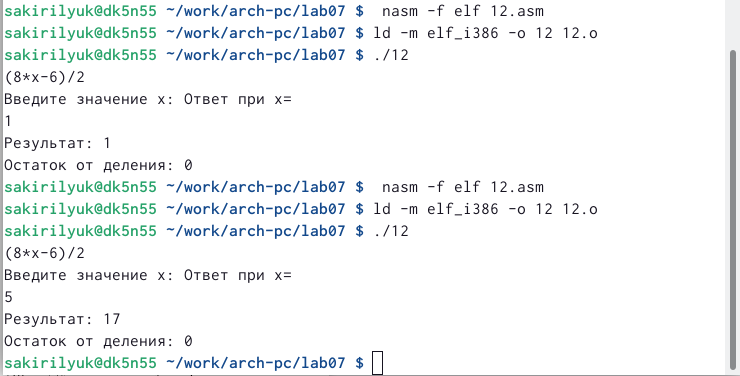{ #fig:fig23 width=90% }.

# Выводы

В ходе лабораторной работы я освоила арифметические инструкции языка ассемблера NASM.
