---
## Front matter
title: "Лабораторная работа №8"
subtitle: "Архитектура компьютера"
author: "Кирилюк Светлана Алексеевна"

## Generic otions
lang: ru-RU
toc-title: "Содержание"

## Bibliography
bibliography: bib/cite.bib
csl: pandoc/csl/gost-r-7-0-5-2008-numeric.csl

## Pdf output format
toc: true # Table of contents
toc-depth: 2
lof: true # List of figures
lot: true # List of tables
fontsize: 12pt
linestretch: 1.5
papersize: a4
documentclass: scrreprt
## I18n polyglossia
polyglossia-lang:
  name: russian
  options:
	- spelling=modern
	- babelshorthands=true
polyglossia-otherlangs:
  name: english
## I18n babel
babel-lang: russian
babel-otherlangs: english
## Fonts
mainfont: PT Serif
romanfont: PT Serif
sansfont: PT Sans
monofont: PT Mono
mainfontoptions: Ligatures=TeX
romanfontoptions: Ligatures=TeX
sansfontoptions: Ligatures=TeX,Scale=MatchLowercase
monofontoptions: Scale=MatchLowercase,Scale=0.9
## Biblatex
biblatex: true
biblio-style: "gost-numeric"
biblatexoptions:
  - parentracker=true
  - backend=biber
  - hyperref=auto
  - language=auto
  - autolang=other*
  - citestyle=gost-numeric
## Pandoc-crossref LaTeX customization
figureTitle: "Рис."
tableTitle: "Таблица"
listingTitle: "Листинг"
lofTitle: "Список иллюстраций"
lotTitle: "Список таблиц"
lolTitle: "Листинги"
## Misc options
indent: true
header-includes:
  - \usepackage{indentfirst}
  - \usepackage{float} # keep figures where there are in the text
  - \floatplacement{figure}{H} # keep figures where there are in the text
---

# Цель работы

Изучение команд условного и безусловного переходов. Приобретение навы-
ков написания программ с использованием переходов. Знакомство с назначе-
нием и структурой файла листинга.

# Выполнение лабораторной работы

Создаём каталог для программ лабораторной работы №8, переходим в него и создаём файл lab8-1.asm (рис. [-@fig:fig1]).

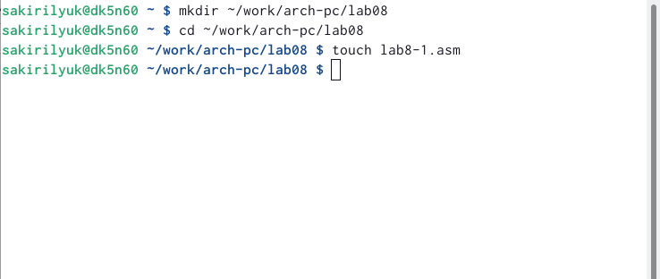{ #fig:fig1 width=90% }

Введём в файл текст программы из 1-го листинга (рис. [-@fig:fig2]). 

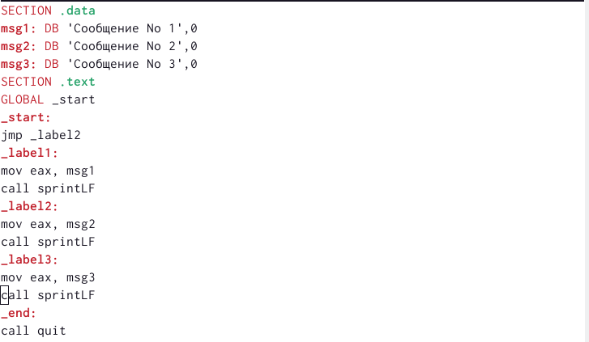{ #fig:fig2 width=90% }

Создадим исполняемый файл и запустим его (рис. [-@fig:fig3]). 

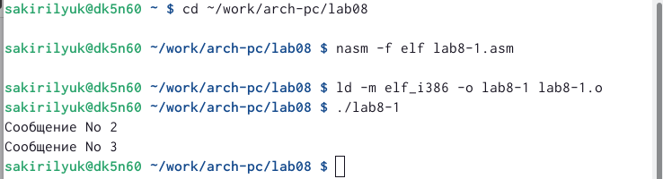{ #fig:fig3 width=90% }

Далее в текст программы после вывода сообщения №2 добавим инструкцию jmp с меткой _end. Изменим текст программы в соответствии со 2-ым листингом (рис. [-@fig:fig4]).

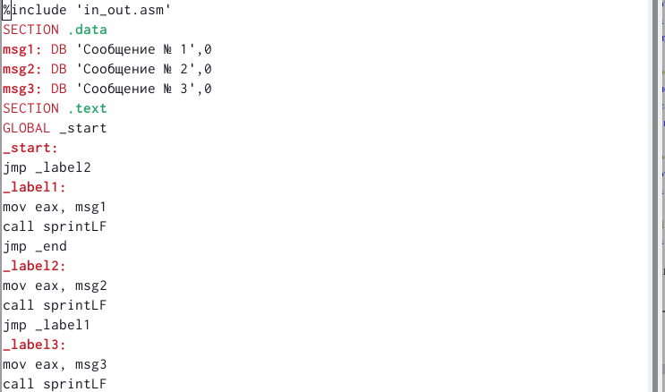{ #fig:fig4 width=90% }

Вновь создаём исполняемый файл и проверяем его работу (рис. [-@fig:fig5]). 

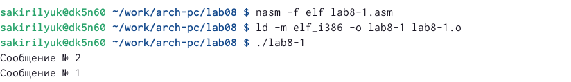{ #fig:fig5 width=90% }

Изменим текст программы, добавив и изменив инструкцию jmp, чтобы сообщения выводились с 3-го по 1-ый (рис. [-@fig:fig6]). Создаём исполняемый файл и проверяем его работу (рис. [-@fig:fig7]). 

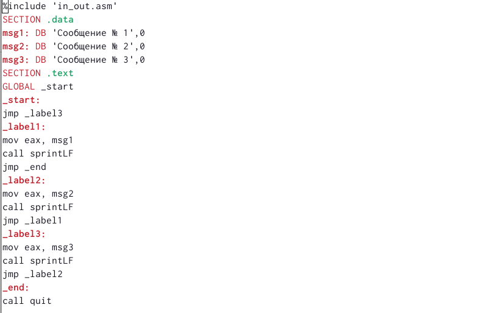{ #fig:fig6 width=90% }

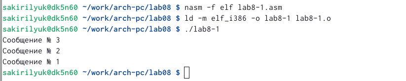{ #fig:fig7 width=90% }

Создаём файл lab8-2.asm (рис. [-@fig:fig8]) и вводим в него текст программы  (рис. [-@fig:fig9]).

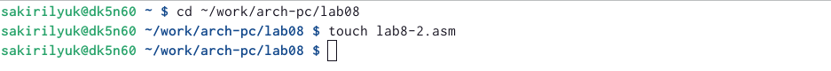{ #fig:fig8 width=90% }

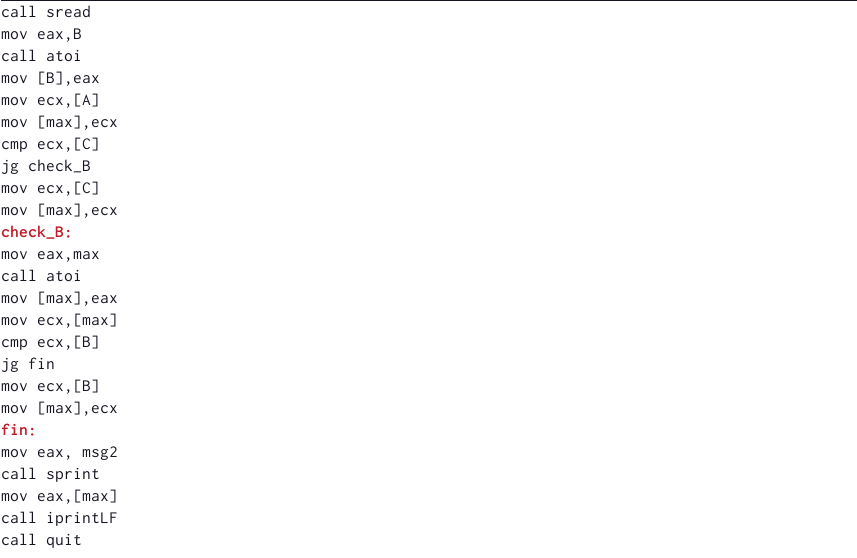{ #fig:fig9 width=90% }

Создаём исполняемый файл и проверяем его работу (рис. [-@fig:fig10]).

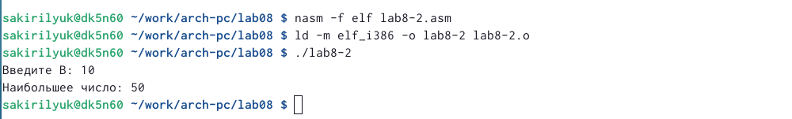{ #fig:fig10 width=90% }

Далее создаём файл листинга для lab8-2.asm (рис. [-@fig:fig11]) и открываем его при помощи текстового редактора (рис. [-@fig:fig12]).

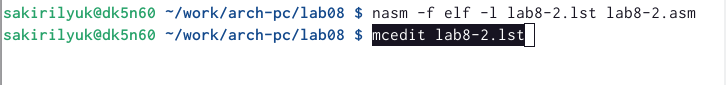{ #fig:fig11 width=90% }

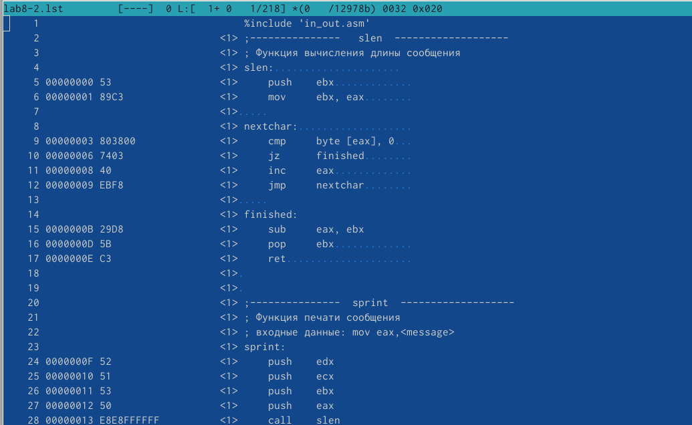{ #fig:fig12 width=90% }

# Выводы

В ходе работы я изучила команды условного и безусловного переходов, приобрела навыки написания программ с использованием переходов, познакомилась с назначе-
нием и структурой файла листинга.

