---
## Front matter
title: "Лабораторная работа №9"
subtitle: "Архитектура компьютеров"
author: "Кирилюк Светлана Алексеевна"

## Generic otions
lang: ru-RU
toc-title: "Содержание"

## Bibliography
bibliography: bib/cite.bib
csl: pandoc/csl/gost-r-7-0-5-2008-numeric.csl

## Pdf output format
toc: true # Table of contents
toc-depth: 2
lof: true # List of figures
lot: true # List of tables
fontsize: 12pt
linestretch: 1.5
papersize: a4
documentclass: scrreprt
## I18n polyglossia
polyglossia-lang:
  name: russian
  options:
	- spelling=modern
	- babelshorthands=true
polyglossia-otherlangs:
  name: english
## I18n babel
babel-lang: russian
babel-otherlangs: english
## Fonts
mainfont: PT Serif
romanfont: PT Serif
sansfont: PT Sans
monofont: PT Mono
mainfontoptions: Ligatures=TeX
romanfontoptions: Ligatures=TeX
sansfontoptions: Ligatures=TeX,Scale=MatchLowercase
monofontoptions: Scale=MatchLowercase,Scale=0.9
## Biblatex
biblatex: true
biblio-style: "gost-numeric"
biblatexoptions:
  - parentracker=true
  - backend=biber
  - hyperref=auto
  - language=auto
  - autolang=other*
  - citestyle=gost-numeric
## Pandoc-crossref LaTeX customization
figureTitle: "Рис."
tableTitle: "Таблица"
listingTitle: "Листинг"
lofTitle: "Список иллюстраций"
lotTitle: "Список таблиц"
lolTitle: "Листинги"
## Misc options
indent: true
header-includes:
  - \usepackage{indentfirst}
  - \usepackage{float} # keep figures where there are in the text
  - \floatplacement{figure}{H} # keep figures where there are in the text
---

# Цель работы

Приобретение навыков написания программ с использованием циклов и обработкой аргументов командной строки.

# Выполнение лабораторной работы

Создаём каталог для программ лабораторной работы №9, переходим в него и создаём файл lab9-1.asm (рис. [-@fig:fig1]).

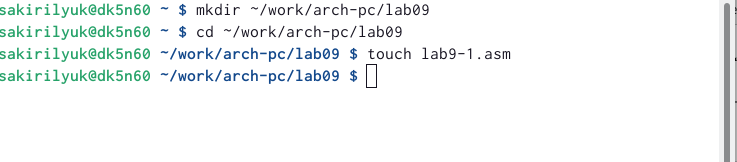{ #fig:fig1 width=90% }

Вводим в файл текст программы из 1-го листинга (рис. [-@fig:fig2]) и создаём исполняемый файл (рис. [-@fig:fig3]).

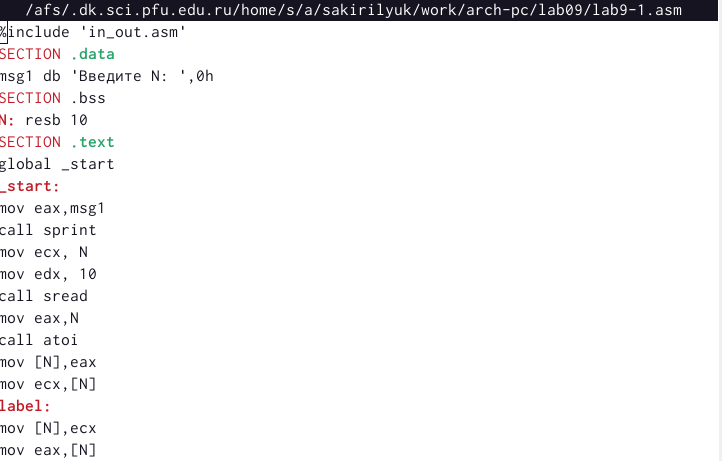{ #fig:fig2 width=90% }

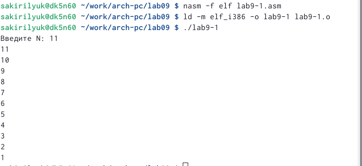{ #fig:fig3 width=90% }

Меняем текст программы, добавив изменение значения регистра ecx в цикле (рис. [-@fig:fig4]), создаём исполняемый файл и проверяем его работу (рис. [-@fig:fig5]).

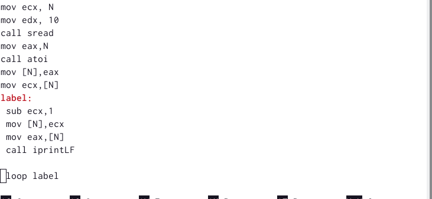{ #fig:fig4 width=90% }

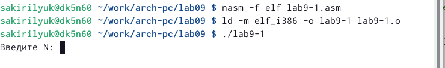{ #fig:fig5 width=90% }

Данный пример показывает, что использование этого регистра в теле цикла может привести к некорректной работе программы. Число проходов не соответствует значению N, введённому с клавиатуры, программа зациклилась.

Снова вносим изменения в текст программы, добавив команды push и pop для сохранения значения счётчика цикла (рис. [-@fig:fig6]), и исполняем файл (рис. [-@fig:fig7]). В данном случае число проходов цикла равно значению N.

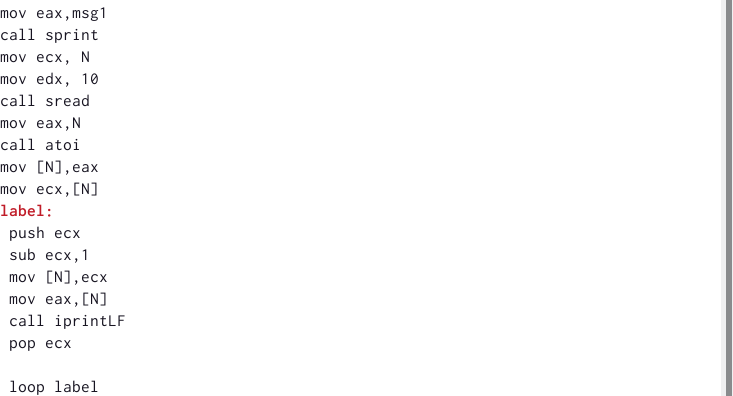{ #fig:fig6 width=90% }

{ #fig:fig7 width=90% }

Создаём файл lab9-2.asm (рис. [-@fig:fig8]) и вводим в него текст программы из 2-го листинга(рис. [-@fig:fig9]). Создаём исполняемый файл и проверяем его работу (рис. [-@fig:fig10]), программой было обработано 4 аргумента.

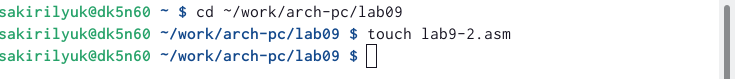{ #fig:fig8 width=90% }

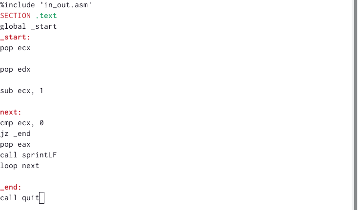{ #fig:fig9 width=90% }

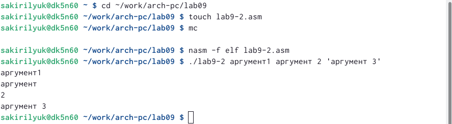{ #fig:fig10 width=90% }

Создаём файл lab8-3.asm (рис. [-@fig:fig11]), вводим текст программы из 3-го листинга (рис. [-@fig:fig12]), создаём исполняемый файл и проверяем его (рис. [-@fig:fig13]).

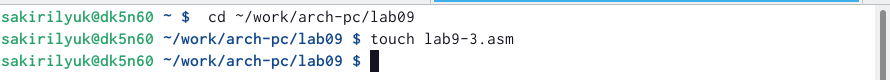{ #fig:fig11 width=90% }

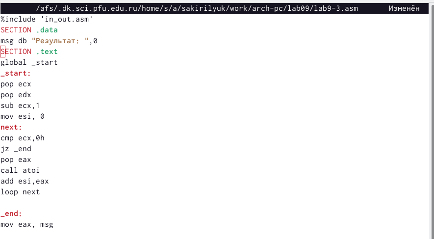{ #fig:fig12 width=90% }

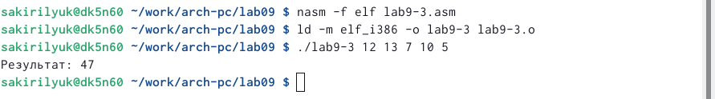{ #fig:fig13 width=90% }

Изменяем текст программы из листинга №3 для вычисления произведения аргументов командной строки (рис. [-@fig:fig14]), создаём исполняемый файл и проверяем его работу (рис. [-@fig:fig15]).

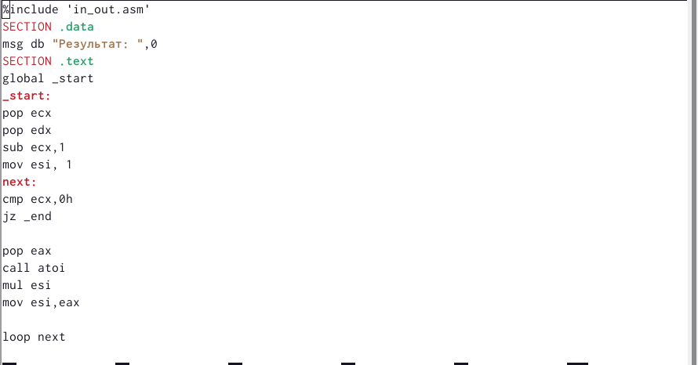{ #fig:fig14 width=90% }

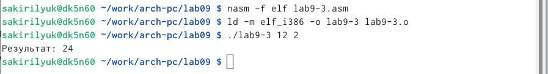{ #fig:fig15 width=90% }

#Задание для самостоятельной работы 

Изменяем текст программы из листинга №3 в соответствии с листингом №3 (рис. [-@fig:fig16]), вновь создаём исполняемый файл и проверяем его работу (рис. [-@fig:fig17]).

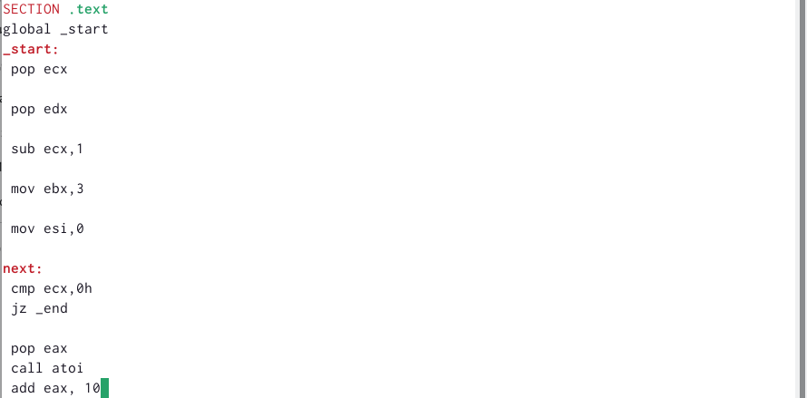{ #fig:fig16 width=90% }

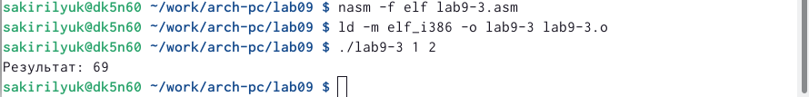{ #fig:fig17 width=90% }
 
# Выводы

В ходе работы я приобрела навыки написания программ с использованием циклов, обработкой аргументов командной строки.
